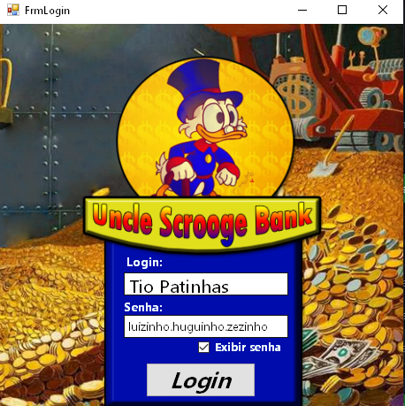
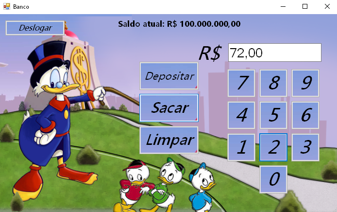
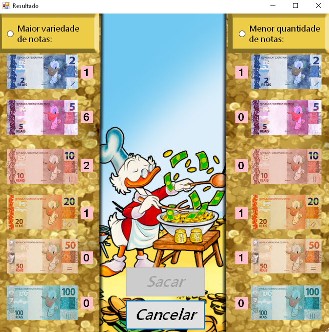
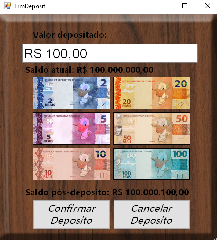

# Uncle-Scrooge-Bank
Programming Software 1 - Project - 2019 - IFSP - Capivari

Project created to conclude our course of Programming Software 1, our teacher instructed to us these objectives that were needed on the system:

<ul>
  <li>1. Needed to be a bank emulation service(where you can withdraw money or deposit)</li>
  <li>2. On the withdraw you need to have 2 options of withdraw:</li>
  <ul>
    <li>1. Withdraw the money with the higher variety of notes</li>
    <li>2. Withdraw the money with the less quantity of notes</li>
  </ul>
</ul> 

Given those points we were free to decide anything on the system, so we decided to create the app with a theme of Uncle Scrooge :D, and also we´ve got our head in to learning to use propperly a local database, so we created the SQL with MYSQL and use the Visual Studio tools to create the database.
 

As we were familiarized with photoshop and image eddition, we´ve created all the interface for this project, so here´s how our formularies are right now:
 

 
*To facilitate our tests we´ve created an user of Uncle Scrooge and setted It on the login screen

 

 
After you Login theres the Withdraw formularie, were you can type in how much money you want to withdraw or if want to deposit 
*We´ve tried to create an interaction with where uncle scrooge point to(If use tab on the buttons his hand will point to other button), It´s cool bug kinda buggy xD

 

 
Here we have our 2 different options that you select with a radio button, you can select the withdraw with less notes or the most variety of notes possible (R$72,00 in this image) 
If you select one to withdraw we get bat to the withdraw screen and the text "Saldo atual:R$ X" updates with the information of how much money you have left in the account(and this also updates the info on the local database)

 

 
Finaly our last screen, where every note is a button and you can click on them to inform what´s the value that you want to deposit

